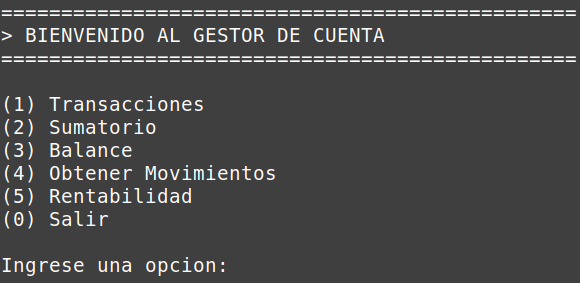
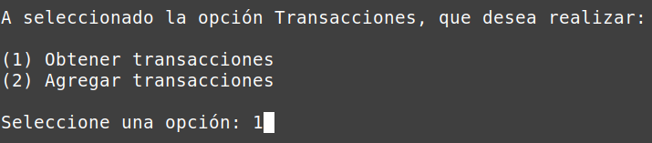
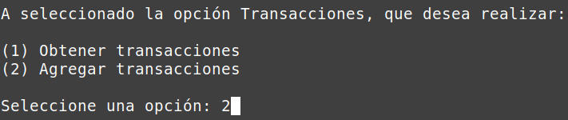
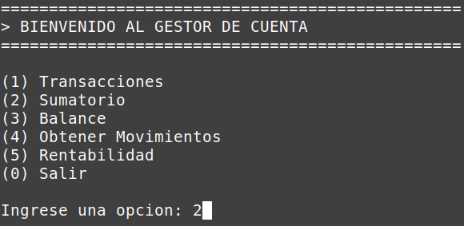
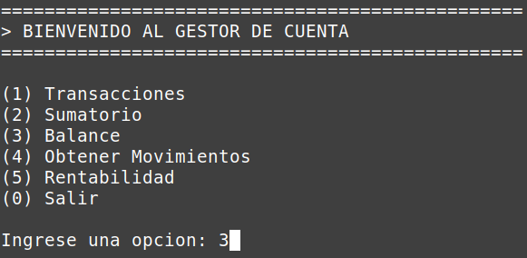
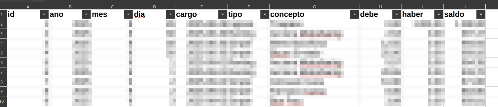
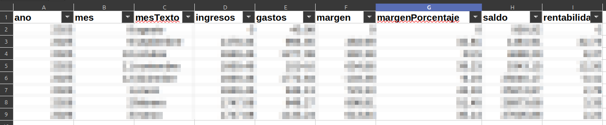
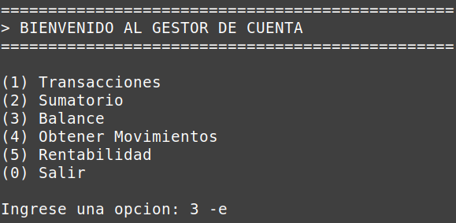
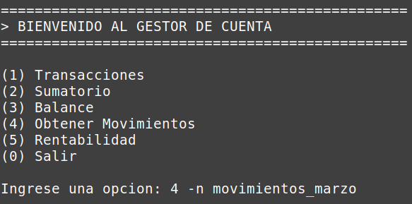

# GESTIÓN DE CUENTAS
## Resumen
Esta aplicación está pensada para realizar un seguimiento de los gastos efectuados a lo largo del año, totalizar los importes según el tipo de gasto (simple, renting, etc.) y exportar esta información a .CSV para que el usuario pueda manipular los datos.

La base de datos utilizada es MySQL y se encuentra alojada en un servidor independiente. La aplicación está estructurada en capas, lo que permite una mejor escalabilidad a largo plazo.

Actualmente, no dispone de una interfaz especialmente amigable, pero el objetivo es ofrecer al usuario una interfaz más sencilla y orientada a la gestión de los movimientos contables de la aplicación.

# FUNCIONES BÁSICAS
El menú dispone de 5 funciones básicas, que pueden seleccionarse introduciendo el número correspondiente a cada opción.

- (1) Transacciones
- (2) Sumatorio
- (3) Balance
- (4) Obtener Movimientos
- (5) Rentabilidad
- (0) Salir

## Transacciones
Permite obtener todos los movimientos o añadir una nueva transacción.

 

### Obtener Transacciones
Podemos visualizar los movimientos **mensuales**, **anuales** o, si se prefiere, a lo largo del **año académico en curso**.

### Añadir Transacciones
Permite añadir nuevos registros. Es necesario que el usuario introduzca **la fecha del cargo (en caso de ser el día actual, no es necesario)**, **el concepto**, **la cantidad** y **el tipo de gasto**.

## Sumatorio
Permite obtener un sumatorio de los gastos realizados. Se pueden filtrar por **mes** y **año**, así como elegir que el cálculo se realice **por concepto** o **por categoría**. Además, ofrece la posibilidad de exportar toda la información en **CSV** y de asignar un nombre al fichero exportado.

## Balance
Permite obtener un resumen de los ingresos y gastos durante todo el año o filtrado por **mes** y **año**. Además, también ofrece la posibilidad de exportar toda la información en **CSV** y de asignar un nombre al fichero exportado.

## Obtener Movimientos
Exporta a **CSV** los movimientos contables registrados durante un período de tiempo determinado, aplicando los conceptos de **debe** y **haber**, y generando un fichero preparado para su tratamiento en **Excel** o **LibreOffice Calc**.

## Rentabilidad
Exporta a **CSV** la rentabilidad de la cuenta corriente para cada mes. Incluye la siguiente información: **año**, **mes**, **fecha**, **ingresos y gastos**, el **margen** (tanto en valor decimal como en porcentaje), el **saldo** y su correspondiente **rentabilidad**.

## Salir
Sale de la aplicación.

# PARAMETROS ACEPTADOS
## Parametro (-e)
La aplicación acepta dos parametros `-e` y `-n`. El primer parámetor (-e) permite al usuario exportar la información que aparece en pantalla a un fichero **CSV**. Ejemplo: `Ingrese una opcion: 3 -e`.

## Parametro (-n [nombre fichero])
El segundo parámetro (-n) permite al usuario exportar la información que aparece en pantalla a un **CSV** y definir el nombre del fichero exportado. Ejemplo: `Ingrese una opción: 5 -n movimientos_marzo`.

